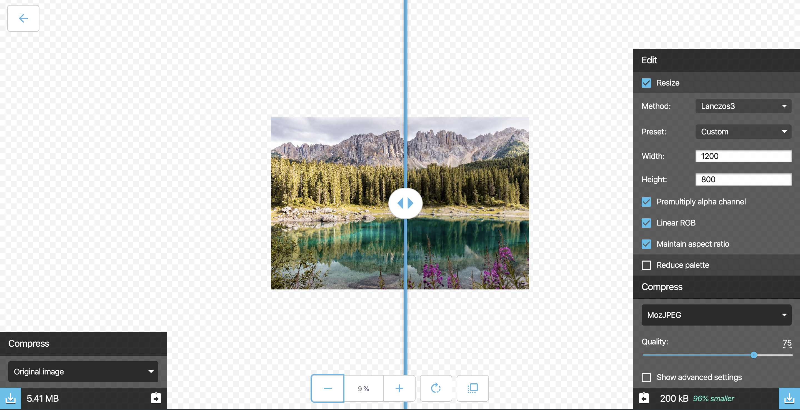
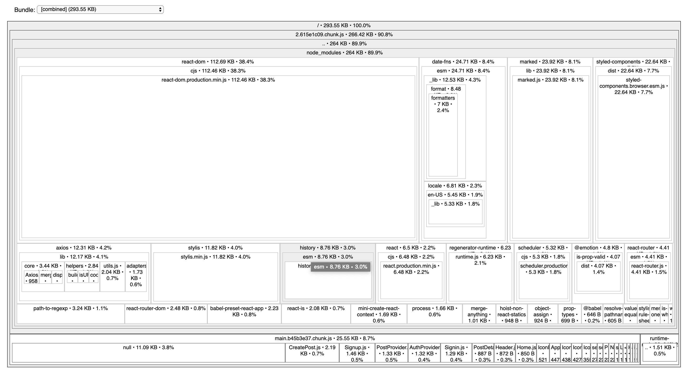

When building a web application, there's something you absolutely need to take account: **performance.** Your app may be greatly designed or have some killer features, nobody will use it if it's not performant. Users are not patient. But how can one make an app more performant? Well, the less your browser has stuff to do, the faster it will be, right? Then, a great strategy to boost your app performance is to give the browser less work, that is to say, reduce the amount of stuff to load. There are easy ways to do so and we'll take a look at three of them today.

## Optimize your images

This is the most easiest thing and one of the most common mistakes you can find out there. When integrating images on an app, you've been told to use the pictures with the highest resolution to have the best quality images. That's great. What you haven't been told is that the images you use from [Unsplash](https://unsplash.com/) or [Pexels](https://www.pexels.com/) often have huge dimensions and are not meant to be displayed on smaller screens.

It's like watching a 10GB 4K movie on an old tiny computer. 4K or not, you won't see many differences. That's the same for images on a website. Thus, you must **reduce the quality and resize the images** in order to make them smaller.

There are plenty of apps that allows you to do so like [squoosh.app](https://squoosh.app/). For example, you can find below an example of an image whose size was reduced on squoosh:



Sure the image on the right is a little bit blurry and less detailed than the one of the left but at this zoom level, it's still looking good to me and it's also **96%** smaller which means your browser loads **5.2MB** less.

## Code splitting

If you're building single-page applications (SPA) with [client-side rendering](https://www.toptal.com/front-end/client-side-vs-server-side-pre-rendering) (as with [create-react-app](https://create-react-app.dev/docs/getting-started/) or [Vue CLI](https://cli.vuejs.org/) for example), this tip will also boost your app with little efforts.

In fact, client-side rendering means you are basically fetching on the server a bare bons HTML document with a JavaScript file (called a [bundle](https://webpack.js.org/#bundle-it)) containing your whole application logic. This approach makes your app longer to load initially but more rich in terms of interaction and route changes. It's a problem since a **long initial load will be perceived badly** by your users.

In fact, you will ship to the client this big JavaScript file **even if your users don't need to use every features of the application** (typically a settings page when you can change your name or modify your password).

To solve this problem, you can use code splitting: _“lazy-load”_ just the things that are currently needed by the user (according to [React's docs](https://reactjs.org/docs/code-splitting.html)).

One common strategy is to split your code based on your different routes. Let's take the example of a fake store app:

```jsx
import { BrowserRouter as Router, Route, Switch } from "react-router-dom"
import React, { Suspense, lazy } from "react"

const Products = lazy(() => import("./Products"))
const Cart = lazy(() => import("./Cart"))
const Settings = lazy(() => import("./Settings"))

const App = () => (
  <Router>
    <Suspense fallback={<div>Loading...</div>}>
      <Switch>
        <Route exact path="/" component={Products} />
        <Route path="/cart" component={Cart} />
        <Route path="/settings" component={Settings} />
      </Switch>
    </Suspense>
  </Router>
)
```

With that approach, if the users want to browse your products, they won't need to load the code associated to the Cart or the Settings page.

It can make your initial load way faster by saving hundreds and hundreds of KB, especially if your other pages use heavy third party libraries, which bring us to the third and last point.

## Reduce the bundle size

We saw how to reduce the bundle size at the initial load. Here we will see how to reduce it but **globally** this time.

Few months ago, I was working on a side-project and I tried to load my app in a [slow 3G mode](https://developers.google.com/web/tools/chrome-devtools/network#throttle). I found it really slow and I thought something must be going wrong with the bundle. I installed a tool to analyze the bundle (we'll see which tool later don't worry 😉) and I found a pretty big package in my bundle called `moment-timezone` though I never installed it. I didn't understand why since timezones were useless to my app. Turns out I was using a time picker which needed `moment-timezone` making it included in the bundle! So, I chose another time picker and my app was **2x** faster if my memory doesn't play tricks on me.

I'm convinced every developer working on the front-end side already had or has this problem. Then I'll show you a method to make your bundle lighter.

### First, analyze the bundle

A great tool to do so is [webpack-bundle-analyzer](https://www.npmjs.com/package/webpack-bundle-analyzer) or [source-map-explorer](https://www.npmjs.com/package/source-map-explorer) for [Create React App users](https://create-react-app.dev/docs/analyzing-the-bundle-size/). I'll show you an example with CRA here. There are few steps to follow:

- Install `source-map-explorer`:

```shell
npm install --save source-map-explorer
```

- Add an `analyze` script to your `package.json` file:

```json
{
  "scripts": {
    "analyze": "source-map-explorer 'build/static/js/*.js'"
  }
}
```

This will run `source-map-explorer` on the JS files generated by `npm run build`.

- Analyze your bundle by running the following commands:

```shell
npm run build
npm run analyze
```

**Note**: Alternatively, you can find all the steps [on Create React App docs](https://create-react-app.dev/docs/analyzing-the-bundle-size/).

By running the script on one of your projects, you should get something similar to that:



You can see in the results that **the bigger a dependency is, the more it takes up place visually**. That's a great way to spot the heaviest dependencies.

I ran `source-map-explorer` on a small project so you can see the bundle is not that big in my case. You'll likely get a heavier bundle and more dependencies on bigger projects.

### Then, get rid of heavy dependencies

Once you have the results, it's up to you to see which dependencies are the heaviest and decide if you must find alternatives for them. To find the cost of a package in your bundle, I recommend [bundlephobia](https://bundlephobia.com/). It's great for **comparing packages** cost and making you wonder if you really need to install that dependency.

For example, I used to use [moment.js](https://momentjs.com/) for date manipulation. But it has a pretty big cost on your package:


In fact, `moment` is not modular. If you need to manipulate dates, then you need to create a `Moment` instance that gives you access to a lot of methods even if you use just one or two of them.

Now, I use [date-fns](https://date-fns.org/) which is way more modular and lighter too:


You can follow the same logic for a lot of dependencies. However, **be pragmatic** when making these choices:

- If you use a package that seems to be both useless and heavy, it may be a good idea to **get rid of it.**
- If it's useful and heavy, then you can start searching for **lighter alternatives.** If there are no alternatives, it can be a great idea to build your own package (it can take time though 😅). But if it seems complicated, then keep it. It's not that bad to have heavy dependencies if they prove to be really useful. It's always possible in that case to lazy load these packages thanks to code splitting!

---

I hope these three tips gave you the will to optimize your apps (and create more stellar experiences for your users!). Of course, there are plenty of other performance tips like:

- Avoiding unnecessary re-renders if you use React or Vue or something similar
- Removing unused CSS with [purgecss](https://github.com/FullHuman/purgecss)
- Making use of caching
- Using CDNs
- Choosing the right type of databases and optimizing them
- Reducing HTTP requests
- Prefetching assets
- And more!

I highly encourage you to explore all these options and see what they can bring to you performance-wise. However, don't be obsessed with that. When it comes to building apps, there are always **trade-offs**. Weigh the pros and cons of your choices 😉

<Comments description="What are your performance tips? Which one do you always use? Please, share them in the comments below." />
