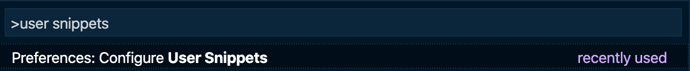
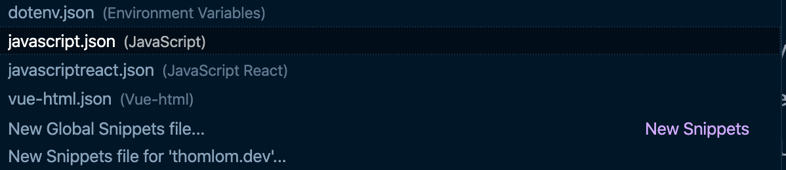

Typing every single character of your code can feel cumbersome. How many times did you declare a function? Created an object? Imported a module? Created a for loop? Created a component if you're a React or Vue developer? I don't even know how many times I did it, but I think the numbers would be pretty scary 😱

Luckily for us, our favorite code editor, VS Code, has the ability to provide us user snippets to avoid typing all this code manually. For example, you can download these snippets as package extension and then, you're able to write code in no time! But what if you find yourself typing a code that no extension provides? What if you have specific conventions or objects you use in your team? Do you have no other choices than doing this chore?

**No.** You can define custom user snippets and that's an easy task! 😌

### Create a snippet

To do so, press `Ctrl + Shift + P` or `Cmd + Shift + P` if you're a macOS user and type `user snippets`:



Select the language for which you're going to create a snippet file. Here we're going to do one for javascript:



VS Code should open a new file with some informations on how to create a snippet. How nice is this? With this first example, you learn that:

- A snippet has a name, a prefix, a description and a body. The prefix represents the characters you need to type to trigger the snippet.
- The body is an array, each element defining a line.
- You need to use `$0`, `$1`, `$2` for your different variables (`$0` is the final position and `$1` and `$2` are tab stops).
- If you want to provide a default value for the variables, you can define placeholders: `${1:placeholder}`

### Console snippet

Let's see a first snippet for logging the content of a variable:

```javascript
console.log("something", variable);
```

Here, you have two variables: the information you want to log and the variable.
You'll probably want to start a new line after logging. To create such a snippet, go to the `javascript.json` file and add the following:

```json:title=javascript.json
{
  "Print to console": {
    "prefix": "csl",
    "body": ["console.log('$1', $2);", "$0"],
    "description": "Logs something to the console"
  }
}
```


Here, we defined two lines in `body`:

1. The first line (first array element) has two variables: `$1` for the information to log and `$2` for the variable.
2. The second lines has just `$0` to indicate your cursor final position so that you can go to a new line.

Voilà! You already have a first snippet that works. And that's just the beginning of what you can do with snippets.

### Try/catch snippet

Let's do another one: writing some code wrapped in a `try/catch` statement!

```json:title=javascript.json
{
  "Try catch": {
    "prefix": "try",
    "body": ["try {", "\t$0", "} catch (${1:err}) {", "\t$2", "}"],
    "description": "Outputs a try/catch statement"
  }
}
```


That one is a little bit trickier to define:

1. The first line of body only has the `try` statement
2. The second line has a tab character (`\t`) to add some whitespaces and `$0` since this is where you'll finally write your code.
3. The third line has the `catch` statement: Here we make use of placeholders to pre-define the alias of the error variable `${1:err}`.
4. The fourth line allows to write the code in the `catch` statement

### Improved console snippet

One cool thing you can do is to give multiple choices for a placeholder, the syntax being: `${1|one,two,three}`.

For example, you can create an improved `console` snippet by choosing which method of console (`log`, `info`, `warn`, etc.) you want to call:

```json:title=javascript.json
{
  "Print to console": {
    "prefix": "csl",
    // highlight-next-line
    "body": ["console.${1|log,info,warn,err|}($2)", "$0"],
    "description": "Logs something to the console"
  }
}
```


### Test snippet

From here, you can do a lot of powerful stuff in your editor. Bootstraping files can be much quicker than before!

For example, I make use of [react-testing-library](https://testing-library.com/docs/react-testing-library/intro) for my tests and I have custom render methods in it. Writing a new test file can be quite long, so I can automate it with a snippet:

```json:title=javascript.json
{
  "New React test file": {
    "prefix": "rtl:customRender",
    "body": [
      "import React from \"react\"",
      "import { screen } from \"@testing-library/react\"",
      "",
      "import { ${1|renderWithRouter,renderWithRouterAndProviders|} } from \"$2\"",
      "import $3 from \"./$3\"",
      "",
      "describe(\"$3\", () => {",
      "\ttest(\"$4\", () => {",
      "\t\t$1(<$3/>)",
      "\t\t$0",
      "\t})",
      "})"
    ],
    "description": "Creates a new React test file with custom render"
  }
}
```


- By using the variable `$3` multiple times, I am able to write once at different places in the code. It's really handy for the component name.
- I am also able to choose which render method to use from a test utils file

By defining all kinds of snippets, you can definitely **improve your workflow and save time!**

If you're working in a team of many developers, it's a great idea to **share these snippets** across your team. In VS Code, you can do so by including these snippets in a `.vscode` folder with a `.code-snippets` extension! 😎

<Comments description="What are your favorite user snippets? Which one are you going to create? Please, share your best user snippets below!" />
