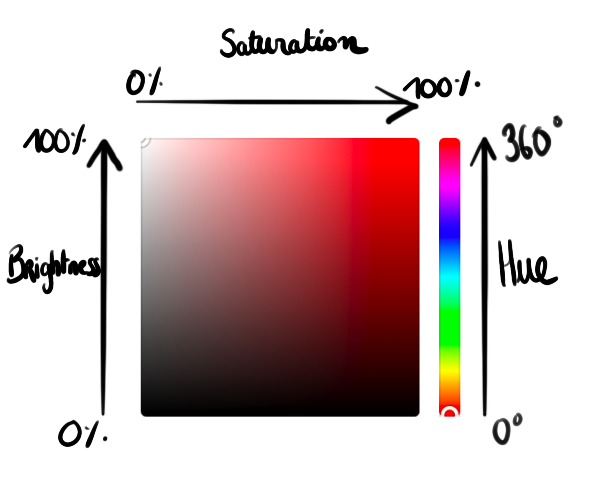
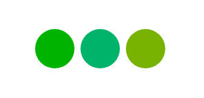
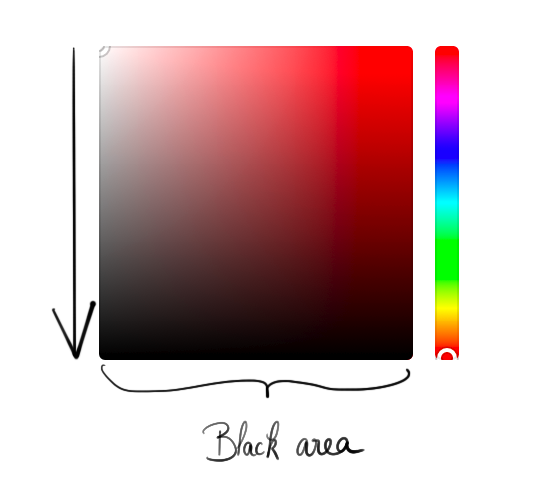
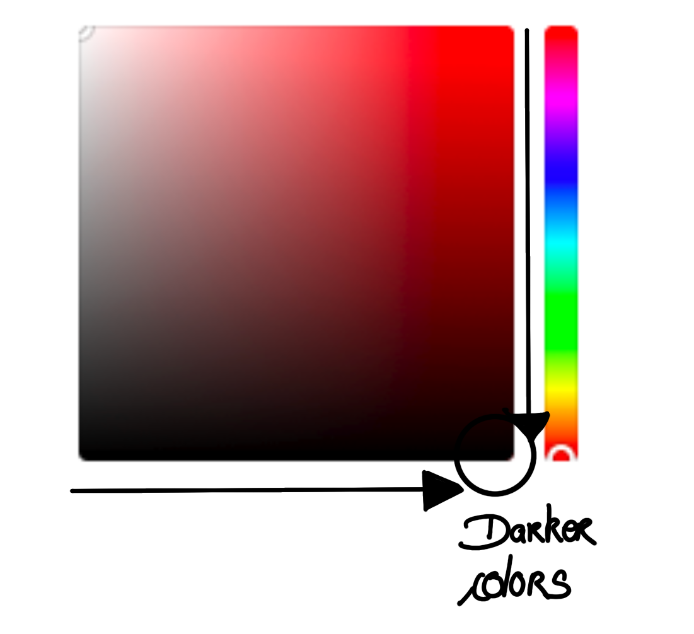
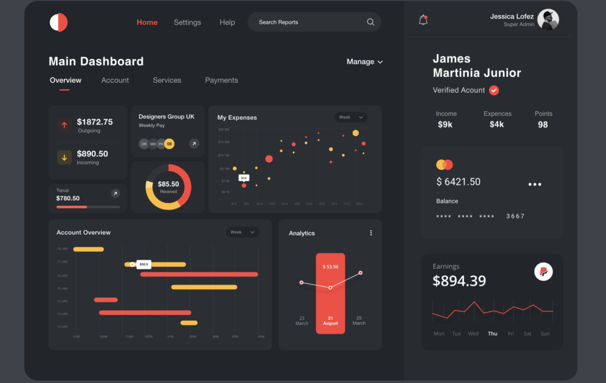

<Note>
  This post has been co-written with <strong>Esther Boulanger</strong> who is UI
  designer. Many thanks to her for helping me with the content and the drawings!
</Note>

What comes first to your mind when you think about design? The first thing that pops into my head is colors. Colors are everywhere and essential for design.

Working with colors seems simple. At least, until you have to design a user interface and choose your color palette. At that moment, you have the writer's block but applied for design. You try to do stuff, but nothing ever looks good. After a while, you think that, who cares, you're not one of these design magicians, you just suck at design. I've been there.

However, it's useful to know at least the fundamentals of what makes a user interface great. And, whether you like it or not, colors are an essential component of it. Without further ado, let's take a look at how you can make use of colors in your UI and much more!

## Color formats

There are a lot of formats for colors. The most popular ones are Hex, RGB, HSB, and HSL. Let me explain the differences between them and which one you should use. 🧐

### Hex and RGB

RGB and Hex are the most common formats for representing colors.

RGB gives us the intensity of red, green, and blue of one color. Intensity is a number that can go from 0 to 255. As an example, you could define a light purple color with 164 of red, 43 of green, and 217 of blue:

```css
.color {
  color: rgb(164, 43, 217);
}
```

Hex stands for hexadecimal. It's similar to RGB, only the format changes: `#RRGGBB`.

As with RGB, R is for the intensity of red, G for green, and B for blue. These values can go from 00 to FF (which means 0 to 255 if you convert it to decimal). For example, `#FF0000` represents a pure red. Indeed, `#FF` means red is at its highest intensity (255) and the others are to their lowest.

I'll say it upfront, those two formats aren't the best when you have to pick colors. Indeed, let's say you want your app to have a blue primary color. You won't have only one blue, right? You'll have to make a lighter blue or a darker blue. Well, good luck doing that with RGB and Hex!

Note: RGB and Hex are not suitable for **picking** colors, but you can still use them for **representing** colors.

That being said, let me introduce you to HSB, HSL and their differences. Let's begin with HSB.

### HSB

HSB means hue, saturation and brightness.

- H stand for **Hue**. It's a number measured in degrees that is between 0 and 360. The following drawing speaks for itself:


If you have a visual memory and you want to pick a color, this drawing will be your best friend.

What about saturation and brightness? For that, let's take a look at the following drawing:


These 4 circles all have the same hue (210°), but still, they look different. Well, that's because of **saturation** and **brightness**.

- S stands for **Saturation**. It's a percentage representing how vibrant color is. 0% means you have no saturation, while 100% means you have the maximum. If you choose to add a blue to your UI with a hue of 210° and saturation of 0%, you'll get a gray color. High saturation, vibrant color. Low saturation, dull color.

To better visualize the saturation for color, here is the blue we saw above with different variations:


- B stand for **Brightness**. It's a percentage representing how bright a color is. Basically, the higher is the brightness, the more your eyes will suffer in the dark. If the brightness is at 0%, you'll get black no matters the hue or saturation.

However, you can get two different results for brightness at 100% depending on the saturation:

1. If the saturation is at 0%, you'll get pure white.
2. If you have a saturation different than 0%, you'll just get a highly-bright color that is more or less vibrant.



The most perceptive of you will think that, OK, HSB is great, but you can't work with HSB in CSS. Instead, CSS supports HSL. Let's see it right away.

### HSL

HSL means hue, saturation and lightness. Thus, the only difference compared to HSB here is the lightness.

Lightness represents how close a color is to black or white.
0% lightness is equal to black (like the brightness), BUT, 100% lightness is equivalent to white **no matter the hue or the saturation**. This is the big difference between brightness and lightness.

Let's take a value example with HSB and HSL. We'll take a hue of 250° (darker blue) and a saturation of 75% (very vibrant).

For HSB, you'll get:

- H=250, S=75%, B=0% → black
- H=250, S=75%, B=100% → very bright blue

For HSL, you'll get:

- H=250, S=75%, L=0% → black
- H=250, S=75%, L=50% → very bright blue (the same as with HSB)
- H=250, S=75%, L=100% → white

There's something I find weird with HSL while designing. When I move the lightness up or down and convert it to HSB, the saturation isn't the same. For that reason, I prefer to work with HSB that seems easier to me.

In the end, it doesn't matter if HSB is not available in CSS. What you can do is to pick your colors upfront with HSB and convert them to hexadecimal values.

You know about color formats. Great. Let's deep dive into the exciting stuff.

## Color variation

Don't trust the tools that magically gives you a palette with 4-5 different colors, it won't work. What you need to learn instead is how to make color variations. Trust me, with gray and a primary color, you can already make pretty good UIs. Look at the apps and websites around you; they usually have one primary color, and still, they look good.

To create color variations, you first have to play with the hue. Indeed, there are 360 shades of colors different in the color wheel. You can get a lot of colors just with the hue. Let's take an example of green color with a saturation of 100% and a brightness of 70% (very vibrant and bright).



Here are the different values of these three circles:

- First circle: H=120°. I get green.
- Second circle: H=156°. I get a green that tends towards the blue.
- Third circle: H=80°. I get a green that tends towards the yellow.

Play with different colors and see what works well or not. Indeed, in design, you have to **TRY** a lot of things to determine what you really want, what is best for you.

Ok. So hue allows us to modify the tone of the color, what about saturation and brightness?

## Create lighter or darker colors with saturation and brightness

Most of the time, you'll want to use saturation and brightness to create lighter or darker colors. Let's start with a darker color.

In your opinion, what would you have to do to have a darker color? You'd probably think we would just have to tune the brightness down, right?



Well, let's try that on an example:


This is what you can get by using this method. Take a look at the last two greens. They're way too dark! Indeed, by only decreasing the brightness, your color also gets less colorful. We can fix it by increasing the saturation:



Let's try again:


Look at these new shades of green: that's way better!

For a lighter color, you need to do all the contrary: increase the brightness and decrease the saturation.


Let's take an indigo color and create lighter variations:


By increasing the brightness and decreasing the saturation, you get lighters blue.

So, remember:

- **Darker color = saturation up, brightness down**
- **Lighter color = saturation down, brightness up**

Congratulations, you just unlocked the power of color variations! 😎

You can also move the hue up or down along saturation and brightness to get lighter or darker colors. There are no magical formulas for creating color variations. The key is to adjust your values until it looks good to you. I know, _easier said than done_, but at least, you know now how to easily make a color darker or lighter. 😏

## Choosing colors

Don't get me wrong, as of today, I still struggle with colors. However, I learned some things along the way. You'll find below a handful of color tips that I think will be useful to you.

### Gray

When you design UIs, you need to understand that **gray is essential.** Before even choosing colors, you need to design your applications only with different shades of gray.

Once done, you can think of colors. However, don't paint your whole app, only apply colors where that's necessary: for the navigation bar, buttons, backgrounds, maybe on some words but not everywhere! The more I look at stunning designs, the more I realize they're really subtle.

### Picking colors

You probably ask yourself how to pick colors. You're not going to like this answer, but it depends. Usually, you can consider that one or two colors are enough! Stick with them and use them sparingly.

If you already have a logo, you can pick its primary color since it's your brand's main color. For example, facebook's logo is a blue F. Let's take a look at their UI:


You can notice that the same blue is used everywhere but with different variations. One color and it looks good! Note also that the rest of the app is made of gray. 😉

Blue is a great starter color. Be careful though, it tends to be overused. We saw above that Facebook uses blue, but it's not the only one, far from it. Twitter also uses it as an example!

Choose your colors according to your brand and your audience. As an example, if you're designing a bank app, you'll probably want to choose sober colors since it inspires professionalism. On the contrary, if you want to make your app playful, such as the famous Duolingo, choosing vibrant colors (saturation, remember?) will be a great choice:


_Note: the content is in French, but nevermind we're looking at the UI, right?_

Don't make the obvious choice. It's not because you're designing for ecology that you have to choose green colors. Sometimes, selecting original colors can make your app stand out!

### Gradients

If you’re not satisfied with a particular color, you can use gradients. Here are different gradients:


It's not that hard to create one. Choose a color and make the second one lighter or darker. I also find gradients to look better when the second color has a different hue. So, when creating gradients, it's fine to tune everything: hue, saturation and brightness.

Here's an example of a design made by [Walid Beno on Dribbble](https://dribbble.com/shots/8660936-Birds-Guide-APP). He makes use of gradients on background and buttons. The result is stunning:


### Secondary colors

Most of the time, you'll still want to have a secondary color in your application. Something that works great is to **associate a cold color with a warm color**: purple with orange, red with blue, yellow, with blue, whatever! Here's an example of a design made by [Sight Setyo Nugroho for OWW on Dribbble](https://dribbble.com/shots/7079177-Bengkelan-The-Auto-Mechanic-That-Comes-To-You-Website-Concept):


### Dark interfaces

You may want to go with a dark interface. Obviously, your app will be filled with black or dark gray. In this situation, choose colors that are highly-contrasted with dark (so, high saturation). Usually, yellow, orange, or purple (but not too dark) look great. Here's an example [by DStudio on Dribbble](https://dribbble.com/shots/10090105-Dashboard-UI):



Design isn't easy. Picking colors isn't easy. Even creating color variations isn't easy. The more you design, the better you get. There are rules in design that you can leverage to build great UIs, as we saw with color variations. But, it won't magically make you a design master. At first, you will suck. But after producing dozens of designs and lots of color variations, you'll start to get better at it.

<Comments />
