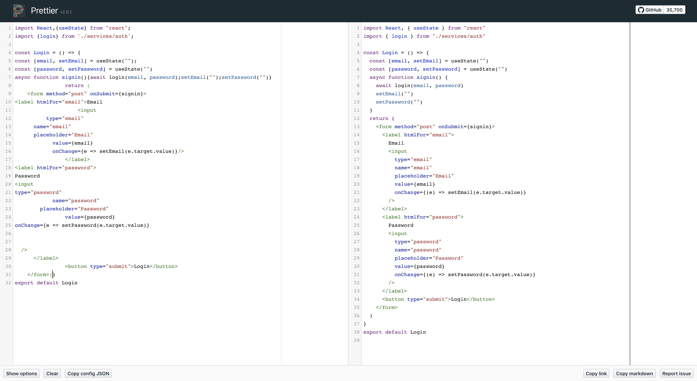

Building high-quality apps is hard for many reasons:

- The more your codebase grow, the more it becomes hard to maintain.
- Developers have different way to code, which can confuse you and slow you down.
- JavaScript is a language that seems easy to learn at first, but it's not that easy. You can fall into common pitfalls. The same goes with React (or any other front-end library/framework).
- Etc.

That's why nowadays, there are many tools that allow us to write quality code and make sure our apps don't break. You may think of testing tools like [Jest](https://jestjs.io/), [React Testing Library](https://testing-library.com/docs/react-testing-library/intro) or [Cypress](https://circleci.com/) at first, but before even writing tests, you can add a first layer of safety in your app with **a linter**.

## Lint your code

A linter **analyses statically your code.** It means it checks out the code without executing it. But why use a linter you might think? Because you can build an app while writing awful code. Thus, it's essential to have a tool that spots for you common errors and bad practices.

The best part of a linter is that it can find potential errors in your code that don't look like them. As an example, here is a for-loop that, at first glance, will log numbers from 0 to 4:

```javascript
for (var i = 0; i < 5; i++) {
  setTimeout(() => console.log(i), 1000)
}
```

However, it logs five times `5`. Curious, right? The reason behind this is that the `var` keyword is **function-scoped.** As there are no functions here, `i` will be a global variable. Thus, by the time the first `setTimeout`'s callback finishes runnig, the loop has always been executed and so, the last value of `i` is 5.

You can fix this behavior by using the `let` keyword, which is **block-scoped**:

```javascript
for (let i = 0; i < 5; i++) {
  setTimeout(() => console.log(i), 1000)
}
```

This time, each iteration has its own `i` variable and is not declared globally.

It's almost impossible to guess what would happen here if you haven't run into it at least once in your developer's life. But a linter can! It would see you're using the `var` keyword in a for-loop and that inside this loop, you're using a function that references variables outside of its scope which seems like a bad practice. Thus, it would throw an error at you and you would know what to do.

## ESLint

Now that you saw why linting your code is important, let's discover **ESLint**. It's an open-source project originally created by [Nicholas C. Zakas](https://humanwhocodes.com/) which provides a pluggable linting utility for JavaScript.

Basically, ESLint parses your code, analyses it and run linting rules that may trigger warning or errors to let you know if your code is right or wrong. For example, one popular rule is [no-undef](https://eslint.org/docs/rules/no-undef): it makes sure your code doesn't have any undeclared variables. With `no-undef`, the following code would be incorrect:

```javascript
// ❌ Oops, what is add?
const result = add(1, 2)
```

Indeed. ESLint wouldn't know what `add` refers to and would throw an error at you. You need to explicitly declare `add` to correct it:

```javascript
// ✅ Correct
function add() {}
const result = add(1, 2)
```

### Install ESLint

You can install ESLint in two different ways:

1. Globally: `npm install eslint -g`
2. On a project: `npm install eslint --save-dev`

I recommend that you install ESLint directly in a project. Indeed, if you install it globally, you could make ESLint clashing with your other projects or with other developers (and then you could run into one these _"It works on my machine!"_ problems).

**Note**: You can also use the [ESLint extension for VSCode](https://marketplace.visualstudio.com/items?itemName=dbaeumer.vscode-eslint). It'll deeply improve your developer experience by highlighting errors and warnings directly in your code.

### Configure ESLint

What's great with ESLint is that it's highly configurable. All you have to do is to create a `.eslintrc` file at the root of your project and then you can run ESLint on any files you want.

**Note**: it is also possible to define an ESLint configuration inside a `package.json` file. For that, just put your configuration object in a `eslintConfig` key.

This configuration file takes the form of a JSON object. You can specify many options to do so:

#### parserOptions

The [parserOptions](https://eslint.org/docs/user-guide/configuring#specifying-parser-options): tells ESLint how you want it to parse your code. Most of the time, you specify which ECMAScript version (ES6, ES2018, etc.) you are using with the `ecmaVersion` key. This is also where you tell ESLint if you use ECMAScript modules (`import` and `export`) by setting `sourceType` to `module`.

#### environment

`environment` defines predefined global variables you're using. For example, Jest allows you to use global variables in your test files such as `describe`, `it` or `test`. However, ESLint won't know what these variables refer to if you haven't explicitely told it. For that, set `jest` to `true`.

#### globals

You might be sometimes declaring global variables by yourself. Then, you need to add them in this object.

#### plugins

Basically, plugins are a set of ESLint rules related to a same subject. As an example, [eslint-plugin-react](https://github.com/yannickcr/eslint-plugin-react) contains many rules related to React.

**Caution**: you have to install the plugin as a dev dependency if you want your rules to work properly.

#### rules

These are the linting rules we were talking about before. Each rule has a value that is either `off` if you want to disable the rule, `warn` if it should show a warning or `error` if it should throw an error.

#### extends

Allows you to extend your configuration file from others configurations. A popular one is `react-app` provided by [Create React App](https://github.com/facebook/create-react-app). That's also in `extends` that you can use popular style guides such as the one of [Airbnb](https://www.npmjs.com/package/eslint-config-airbnb), [Google](https://github.com/google/eslint-config-google) or [Standard](https://github.com/standard/eslint-config-standard).

#### Inline configuration

You can modify ESLint's configuration inline with special comments. As an example, you could do the following to the incorrect code related to `no-undef`:

```javascript
// eslint-disable-next-line
const result = add(1, 2)
```

With that, ESLint will stop complaining.

**Use it with caution though!** It's not a good idea to disable ESLint every time it spots errors, it often means something's wrong with your code.

### ESLint CLI

ESLint has a CLI to lint files. You can find all the options [on ESLint's docs](https://eslint.org/docs/user-guide/command-line-interface#options). The one you will use the most is the `--fix` option which fixes the files when ESLint can. For example the following command lints every file present in the codebase:

```shell
eslint .
```

Then you can include these scripts in your `package.json` file:

```json
{
  "scripts": {
    "lint": "eslint .",
    "lint:fix": "eslint --fix ."
  }
}
```

You can use these scripts using the `npm run` command. One will just lint the codebase while the other one will lint and try to fix whatever it can fix.

### ESLint Configuration examples

Here is an example of a `.eslintrc` file:

```json:title=.eslintrc
{
  "env": {
    "commonjs": true,
    "es6": true,
    "node": true
  },
  "extends": "eslint:recommended",
  "parserOptions": {
    "ecmaVersion": 2018
  },
  "rules": {
    "no-console": "error"
  }
}
```

In this configuration, we:

- Extend the `eslint:recommended` configuration
- Tell ESLint we'll use CommonJS global variables (`require` instead of `import`)
- Specify we'll write our JavaScript with the 2018 version of ECMAScript syntax
- Disallow the use of `console.log`.

Here is another ESLint configuration:

```json:title=.eslintrc
{
  "env": {
    "browser": true,
    "jest": true,
    "es6": true
  },
  "plugins": ["import"],
  "extends": "eslint:recommended",
  "parserOptions": {
    "ecmaVersion": 2018,
    "sourceType": "module"
  },
  "rules": {
    "no-console": "warn",
    "no-eval": "error",
    "import/first": "error"
  }
}
```

This ESLint config meets the following requirements:

- Includes the recommended ESLint rules
- Includes `jest`'s, `es6`'s and `browser`'s global variables
- Disallows the use of `eval`
- Warns the user if it uses `console.log`
- Includes the [import](https://github.com/benmosher/eslint-plugin-import) plugin and [reports any imports that come after non-import statements](https://github.com/benmosher/eslint-plugin-import/blob/master/docs/rules/first.md)
- Indicates the parser you're using ES2018's syntax

If you're curious, you can also check out what the [configuration of create-react-app](https://github.com/facebook/create-react-app/blob/master/packages/eslint-config-react-app/index.js) looks like under the hood, it's really interesting!

## Prettier

You now know how to enforce some guidelines in your project and avoid common pitfalls with ESLint, Great! Now what? **Formatting your code**.

Imagine you work in a team of three developers on the same project:

- One developer always uses single quotes instead of double quotes.
- Another one uses indentation of four spaces and make its line very short.
- However, you prefer indentation of two spaces and you usually use double quotes.

Then, what happens if you need to collaborate on a same project? Well:

- Your code **is a mess**.
- You **waste your time rewriting** others code with your own code style

How can you fix it? Use a common code style. How to do it? With [Prettier](https://prettier.io/): an opinionated code formatter. It obviously supports JavaScript but also [many other languages](https://prettier.io/docs/en/index.html) like
JSX, CSS, JSON or Vue.

### Install Prettier

You can install Prettier in two different ways:

1. Globally: `npm install prettier -g`
2. On a project: `npm install prettier --save-dev`

Just like ESLint, I recommend that you install Prettier in a project instead of globally because it could be clashing with other projects.

**Note**: You can also use the [Prettier extension for VSCode](https://marketplace.visualstudio.com/items?itemName=dbaeumer.vscode-eslint). It'll deeply improve your developer experience by formatting your code from VSCode.

### Configure Prettier

Prettier as said above is an opiniated code formatter. They will format your code by default in a way that you may not like. But they allow you to modify a few things. You can configure it via a `.prettierrc` file or via a `prettier` key in your `package.json` file. As an example, here are some rules you can configure:

- `singleQuote`: `true` if you want to use single quotes, `false` otherwise.
- `printWidth`: a number that specifies the line length that the printer will wrap on.
- `semi`: `true` if you want to print semicolons at the end of every statement, `false` otherwise.

Click [here if you want to find more option](https://prettier.io/docs/en/options.html).

### Prettier CLI

Prettier, just like ESLint, has a CLI to format files. You can find many options on [Prettier's docs](https://prettier.io/docs/en/cli.html). The one you will use the most is the `--write` option which is similar to the `--fix` option of ESLint. For example the following command formats every `.js` or `.jsx` file located in a `src` folder:

```shell
prettier --write src/*.(js|jsx)
```

Then you can use this CLI option to include a format script in your `package.json` file:

```json
{
  "scripts": {
    "format": "prettier --write \"**/*.+(js|jsx|json|css|md)\""
  }
}
```

Now, you just have to run `npm run format` to format your entire codebase.

### Integrate Prettier with ESLint

Prettier can format our code, but who said ESLint doesn't? Indeed, ESLint has formatting rules too like [max-len](https://eslint.org/docs/rules/max-len) (similar to `printWidth`) or [quotes](https://eslint.org/docs/rules/quotes). Well, if you use Prettier, you aren't going to need such rules. Prettier **replaces** ESLint's **formatting** rules but **doesn't** replace **code-quality** rules.

Thus, you can integrate Prettier in your ESLint configuration by installing the following:

```json
npm install --save-dev eslint-config-prettier eslint-plugin-prettier
```

`eslint-config-prettier` disables rules that conflict with Prettier while `eslint-plugin-prettier` adds the rule that format content using Prettier. You can enable this configuration by using the recommended one:

```json
{
  "extends": ["plugin:prettier/recommended"]
}
```

### Prettier Configuration example

Here is an example of a Prettier configuration:

```json:title=.prettierrc
{
  "printWidth": 85,
  "arrowParens": "always",
  "semi": false,
  "tabWidth": 2
}
```

Basically, it means that Prettier:

- Will wrap on line that exceed 85 characters.
- Will always use parenthesis around arrow functions, even if there is one argument.
- Won't print semicolons at the end of every statement.
- Will use two spaces per indentation-level.

Let's take an example of a simple yet messy React component and visualize the effects of Prettier by trying out its [online playground](https://prettier.io/playground/):



That's instantly more readable and trust me, you would have wasted your time formatting this by hand. So **using a formatter is essential.**

## Lint and format at each commit

You can lint and run a codebase, great. But does it mean that now you should lint and format your code whenever you want? **No!**

If you use Git in your project - and who doesn't - you can make use of [Git hooks](https://git-scm.com/docs/githooks) to run ESLint and Prettier before each commit or each push. Then, your code is constantly linted and formatted before deploying to production 😉

### husky

We're not talking about the dog here. We're talking about the [tool](https://github.com/typicode/husky) that allows you to setup Git hooks very easily. Let's say your `package.json` has the following scripts and you want to run `lint` and `format` at each commit:

```json
{
  "scripts": {
    "start": "react-scripts start",
    "build": "react-scripts build",
    "test": "react-scripts test",
    "eject": "react-scripts eject",
    "lint": "eslint .",
    "format": "prettier --write \"**/*.+(js|jsx|json|yml|yaml|css|md|vue)\""
  }
}
```

Then, you can add Git hooks in two easy steps:

1. Install husky as a dev dependency:

```shell
npm install --save-dev husky
```

2. Insert the following in your `package.json`:

```shell
{
  "husky": {
    "hooks": {
      "pre-commit": "npm run lint && npm run format"
    }
  }
}
```

That's all. At each commit, the command associated to `pre-commit` will be run and so your codebase will be linted and formatted.

`pre-commit` is by far the most used Git hook but you can also use [other hooks](https://git-scm.com/docs/githooks) like `pre-push` or `post-commit`.

### lint-staged

Bear with me, this tool will be the last to setup. The more your codebase will grow, the more linting and formatting will be longer. Imagine you have more than 1000 components, you don't want to wait for ESLint to lint all your codebase. In the end, the only files that need to be linted are the one that just have been modified. For that, you can use [lint-staged](https://github.com/okonet/lint-staged). Indeed, this tool will make sure you'll lint files that **will be committed**, that is to say, the ones that are **staged**.

To install it, you have to run the following command:

```javascript
npm install --save-dev lint-staged
```

Then, for the configuration, you have to either add a `lint-staged` key to your `package.json` or a `.lintstagedrc` file. According to [lint-staged docs](https://github.com/okonet/lint-staged), the configuration should be an object where each value is one or more commands to run and its key is a glob pattern to use for these commands. Here is an example:

```json
{
  "lint-staged": {
    "*.+(js|jsx)": ["eslint --fix", "git add"],
    "*.+(json|css|md)": ["prettier --write", "git add"]
  }
}
```

This configuration will allow you to run ESLint and fix both `.js` and `.jsx` files. In the same time, it will run Prettier on `.json`, `.css` and `.md` files. For both keys, we use `git add` to add the potential modified files to the staging area before committing.

## Setup ESLint and Prettier on a React app with a precommit

In this part, we are going to see how to setup Prettier, husky and lint-staged on an app generated by [create-react-app](https://github.com/facebook/create-react-app). More precisely, we will:

1. Add the Prettier's recommended configuration to ESLint and add the following formatting rules (see [Prettier's options](https://prettier.io/docs/en/options.html)):

- The `printWidth` must be set to 90
- There should be no spaces between brackets in object literals.
- There should be trailing commas where valid in ES5

2. Add husky and lint-staged to lint and format only staged files:

- There should be a `pre-commit` hook that runs `lint-staged`
- Non-javascript files (CSS, JSON, HTML, etc.) should be formatted using Prettier
- JS and JSX files should be linted (and reformatted thanks to Prettier's plugin for ESLint)

Let's create a React app. Go to the folder you usually work in and run:

```shell
npx create-react-app react-eslint-prettier-app
```

**Note**: If you're not able to use [npx](https://blog.npmjs.org/post/162869356040/introducing-npx-an-npm-package-runner), it probably means you're using an outdated version of npm (< 5.2). To solve it, either update npm or install `create-react-app` globally using `npm install -g`.

First, let's see how to setup Prettier. For that we need to install in our `devDependencies` Prettier and its plugins:

```shell
npm install --save-dev prettier eslint-config-prettier eslint-plugin-prettier
```

As a reminder, `eslint-config-prettier` will disable all ESLint formatting rules that may conflict with Prettier's rules. `eslint-plugin-prettier` is the plugin that will add Prettier's formatting rules.

Then, let's tell ESLint we'll use Prettier's recommended configuration:

```json
{
  "eslintConfig": {
    "extends": ["react-app", "plugin:prettier/recommended"]
  }
}
```

Once done, we need to specify the options to Prettier. For that either create a `.prettierrc` file or add a `prettier` key to the `package.json`. We'll choose the second option:

```json
{
  "prettier": {
    "printWidth": 90,
    "bracketSpacing": false,
    "trailingComma": "es5"
  }
}
```

Let's add the `pre-commit` hook on staged files. We need to install both `husky` and `lint-staged` in the `devDependencies` for that:

```shell
npm install --save-dev husky lint-staged
```

Then, we'll add the `pre-commit` hook itself by adding a `husky` key to `package.json`:

```json
{
  "husky": {
    "hooks": {
      "pre-commit": "lint-staged"
    }
  }
}
```

If we leave this as-is, it will fail because we haven't specified the configuration for `lint-staged`, so let's do it right away:

```json
{
  "lint-staged": {
    "*.+(js|jsx)": ["eslint --fix", "git add"],
    "*.+(json|css|md)": ["prettier --write", "git add"]
  }
}
```

Here we use ESLint to lint and format JS and JSX files. We also use Prettier to format `json`, `css` and `markdown` files. **And voilà! You're perfectly set up.** Here is the full `package.json` file:

```json
{
  "name": "react-eslint-prettier-app",
  "version": "0.1.0",
  "private": true,
  "dependencies": {
    "react": "^16.8.6",
    "react-dom": "^16.8.6",
    "react-scripts": "3.0.1"
  },
  "devDependencies": {
    "eslint-config-prettier": "^6.0.0",
    "eslint-plugin-prettier": "^3.1.0",
    "husky": "^3.0.0",
    "lint-staged": "^9.2.0",
    "prettier": "^1.18.2"
  },
  "scripts": {
    "start": "react-scripts start",
    "build": "react-scripts build",
    "test": "react-scripts test",
    "eject": "react-scripts eject"
  },
  "eslintConfig": {
    "extends": ["react-app", "plugin:prettier/recommended"]
  },
  "prettier": {
    "printWidth": 90,
    "bracketSpacing": false,
    "trailingComma": "es5"
  },
  "husky": {
    "hooks": {
      "pre-commit": "lint-staged"
    }
  },
  "lint-staged": {
    "*.+(js|jsx)": ["eslint --fix", "git add"],
    "*.+(json|css|md)": ["prettier --write", "git add"]
  },
  "browserslist": {
    "production": [">0.2%", "not dead", "not op_mini all"],
    "development": [
      "last 1 chrome version",
      "last 1 firefox version",
      "last 1 safari version"
    ]
  }
}
```

If all goes well, you should have a `pre-commit` hook that both lints and format your code. You can find below a video of what running a pre-commit hook with the configuration above looks like:

<iframe
  width="560"
  height="315"
  src="https://www.youtube.com/embed/rhKa5ICkrGk"
  frameborder="0"
  allow="accelerometer; autoplay; encrypted-media; gyroscope; picture-in-picture"
  allowfullscreen
></iframe>

<Comments description="What did you think of this article on ESLint and Prettier? Share your thoughts in the comments." />
