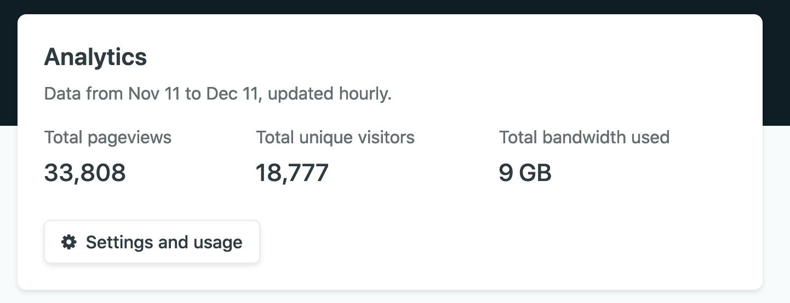
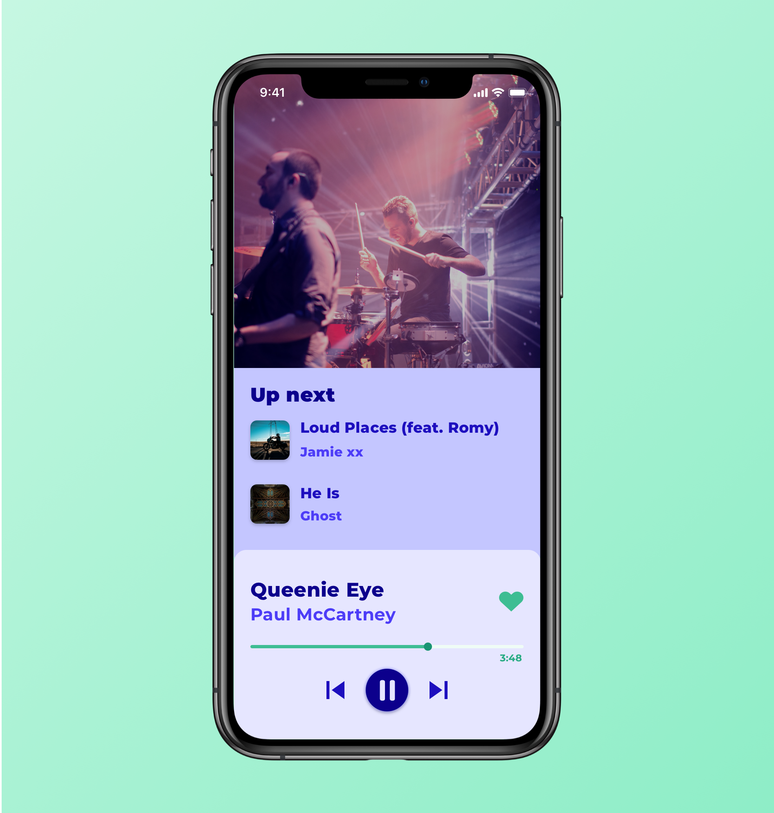

In 2019, I decided to keep a journal and a list of accomplishments throughout the year so that I'm able to know how the year went for me. Honestly, it was a great idea. It's both surprising and instructive to know what you thought at different times of the year and what you did.

I'm going to save you some time: you probably won't be interested in this post I'm talking about what happened in my 2019 year, what were my accomplishments and my failures. With that said, let's begin the review!

Quick summary: I started to learn web development in 2017. I've become a professional web developer in the second semester of 2018. So naturally, I pursue the developer path in 2019, especially on front-end development.

## Learning

I consider that learning is an important aspect of the job and it's something I kept doing this year. **I've read, watched, listened to looooots of stuff:**

- [Refactoring UI](https://refactoringui.com/)
- [Advanced Vue Component Design](https://adamwathan.me/advanced-vue-component-design/)
- [TypeScript fundamentals](https://frontendmasters.comcourses/typescript/)
- [Code Transformation and Linting with ASTs](https:/frontendmasters.com/workshopscode-transformation-linting-asts/)
- [Web Performance](https://frontendmasters.com/workshops/web-perf/)
- [Testing JavaScript](https://testingjavascript.com/)
- [JavaScript: The New Hard Parts](https:/frontendmasters.com/courses/javascript-new-hard-parts/)
- [Webpack 4 Fundamentals](https://frontendmasters.com/courses/webpack-fundamentals/)
- [Git In Depth](https://frontendmasters.com/courses/git-in-depth/)
- [Accessibility](https://frontendmasters.com/workshops/javascript-accessibility/)
- [Fullstack Advanced React & GraphQL](https://advancedreact.com/)

And I don't even count the podcasts, articles and posts I listen or read on a daily basis. I already knew how to build web apps. This year, I wanted to push myself and get the skills needed in order to become an expert in front-end development.

All of this resources allowed me to become a better tester, to deeply understand advanced JavaScript concepts, to manipulate ASTs (for ESLint in particular), to be able to craft accessible, performant and maintainable apps, etc. I really feel confident in my front-end skills thanks to that.

## Blog

I also created my own technical blog with Gatsby: [thomlom.dev](https://thomlom.dev). I've started from scratch and as of today, **I have 600+ unique visitors who read my blog everyday**, so thank you to all the readers of my blog! It takes time to write articles and it's a pleasure to know your content is actually read by persons:

I wrote different types of posts: tutorial (Discord bot), crash course (React Testing Library), reverse-engineering (Polyglot), collection of tips (Time management and productivity tips). However, I think some of my posts were too long. In 2020, I would like to keep writing posts but shorter ones.

## Public speaking

2019 was also the year of my very **first public speaking experiences** as a developer. I gave two workshops on Vue basics in my local city:

- [Découverte de Vue : Réactivité, Directives et To-Do list](https://www.meetup.com/fr-FR/Linkvalue-Tech-Lille/events/259529567/)
- [Créez vos projets web avec Vue CLI - Workshop #2](https://www.meetup.com/fr-FR/Linkvalue-Tech-Lille/events/261639206/)

Persons who attend it liked it and it gave me the will to pursue this in 2020. I have few ideas about what my next meetups/talks/workshops will be and I'm very excited about it!

## Open Source

How could I talk of 2019 without thinking of open source? I wanted to start to contribute to open source projects and this is something I succeeded to do:

- [Small performance tweak for Airbnb Polyglot](https://github.com/airbnb/polyglot.js/pull/132)
- [Adding types for one of dom-testing-library's function](https://github.com/testing-library/dom-testing-library/pull/309) and [improving the docs](https://github.com/testing-library/testing-library-docs/pull/181/files)
- [Creating a rule for Jest's plugin](https://github.com/jest-community/eslint-plugin-jest/pull/407)

But my biggest contribution to open source was mostly helping [another developer](https://github.com/belco90) to create an [ESLint plugin for Testing Library](https://github.com/Belco90/eslint-plugin-testing-library) (automatic releases with `semantic-release` and 100% code coverage 😎). **So far it has 34 stars on GitHub and 8800 downloads per week**. I love open source but I have to admit it takes time. I hope these contributions were just the start because I want to do even more in 2020! 🤯

## Design

I also got hooked on UI and UX Design. I started to learn how to craft beautiful apps and experiences. This is something I started a few months ago so I'm still learning. However, I think I can already draw **good mockups** like this one:

## Some failures

Of course, 2019 had its own set of failures too. My everyday job was... well okay, not a stellar experience, just okay. I also tried to launch other side-projects but failed miserably:

- I tried to build a social app as a side project with someone else. Like every side project, I had lot of ideas and got very excited early on. But I had just too much work going on. I wasn't able to work consistenly on this and eventually, I quit doing it.

- I also tried to launch a YouTube channel for developers. So far, I released a single video: [How to write super-fast HTML with Emmet](https://www.youtube.com/watch?v=3sad_66vGbc). Boy, does it take time to do! I didn't expected the fact that producing videos were that time-consuming. The amount of work is just scaring.

- I also tried to build a course on testing but you know the drill, it took too much time and I quit it.

All of this made me realise I was too demanding with myself and that I should release stuff without working too much on them. But everytime I have to publish work there is always this little voice in my head saying: _"Are you sure? Are you sure you want to publish this potential imperfect work? Do you know that once it's published, people will see it and realise your work is actually bad?"_. It would be great if I could just get rid of that voice and focus on releasing good projects/videos/articles instead of perfect ones.

## What I'm looking forward for 2020

That was 2019, now let's focus on 2020. These are the things I would like to do the upcoming year:

- Learn even more about design. I want to be able to craft professional, good-looking and usable apps. I'm currently doing a challenge to improve myself that's called [Daily UI](https://www.dailyui.co/).
- Upgrade infrastructure and back-end skills. I'm considering following the AWS Developer path on [A Cloud guru](https://acloud.guru/) to learn more about AWS, Docker, serverless, etc.
- Animations: I want to learn how to create good animations. I just know how to do basic animations and I want to be able to build great-looking and fun animations like [this one](https://codepen.io/davidkpiano/pen/xLKBpM) or [this one](https://codepen.io/sdras/pen/gWWQgb).
- Contribute even more into open source.
- Get more into public speaking. I really liked it and I'm looking forward to give more talks in 2020.
- Creating videos? I'm not sure about it but that is something I'm definitely considering in 2020.
- Be happy in my everyday job!

Ideally, I would like to achieve all of that. Maybe I'll want to do other stuff, who knows. In the end, I only want one thing: **be better than I was last year.**

<Comments />
